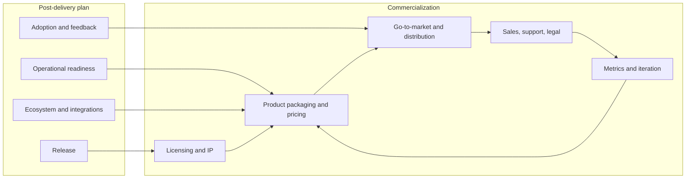

# How to Tackle Commercialization of OpenScript

This plan assumes you have completed (or are well along on) the [post-delivery steps](.cursor/plans/post-delivery_next_steps_882c0afa.plan.md): release, operational readiness, early adoption, ecosystem/integrations, and roadmap. Commercialization builds on that foundation.

OpenScript’s positioning—**prompt security, compliance, risk reduction, real-time protection across any LLM provider**—fits well with security-conscious and regulated buyers (fintech, healthcare, enterprises adopting LLMs). The steps below are ordered so you can start small and scale.

---

## 1. Licensing and IP

Decide how the codebase relates to money and who can do what with it.

- **Clarify ownership**: Ensure you (or your company) own or have rights to all code and that contributor agreements (if any) allow commercial use and relicensing if you need it.
- **Choose a licensing strategy**:
  - **Open core**: Keep a “community” edition under a permissive license (MIT, Apache 2.0) or a reciprocal license (e.g. AGPL). Offer a “commercial” or “enterprise” edition with extra features (e.g. advanced policies, SSO, audit exports, SLAs) under a commercial license. This drives adoption with the free tier and revenue from the paid tier.
  - **Dual license**: Same codebase offered under OSS (e.g. AGPL) and a commercial license for those who want to avoid AGPL obligations (e.g. proprietary products that don’t want to open-source their code).
  - **Fully proprietary**: Everything under a commercial license; no public source. Simpler legally but no community-driven adoption.
- **Document it**: Add a clear `LICENSE` file and a “Commercial” or “Pricing” page that states what is free vs paid and under which terms.

This sets the rules of the game before you sell.

---

## 2. Product packaging and pricing

Define what you sell and how you charge.

- **Tiers** (typical for a security product like OpenScript):
  - **Free / Community**: Self-hosted, core detection and policies, community support (e.g. GitHub, Discord). Good for trials and small teams.
  - **Pro / Team**: Higher limits, more policies, better observability, optional email support. Monthly or annual per-seat or per-deployment.
  - **Enterprise**: SSO/SAML, audit logs, compliance reports, dedicated support, SLA, custom policies or integrations. Annual contract, often custom pricing.
- **Pricing model options**:
  - **Usage-based**: Per scan, per API call, or per “protected LLM call.” Aligns revenue with value; you need metering in the product (you already have metrics—expose or aggregate them for billing).
  - **Seat-based**: Per user or per developer. Simple to explain; can cap usage per seat.
  - **Deployment / instance**: Per environment or per node. Fits self-hosted and “we run it for you” (managed) offerings.
  - **Hybrid**: Base subscription + overage (e.g. $X/month for N scans, then $Y per 1K scans).
- **Differentiate paid tiers**: Map “enterprise” needs to features: SSO, RBAC, audit export, compliance documentation, premium policies or red-team packs, SLA and support. Implement or roadmap the highest-impact ones first.

Start with one or two clear tiers and one primary pricing metric; refine with early customers.

---

## 3. Go-to-market and distribution

Who you sell to and how you reach them.

- **Target customers**: Given “compliance, risk reduction, real-time protection,” focus on: security and platform teams at companies already using or piloting LLMs; regulated industries (finance, healthcare, government); and dev teams building LLM-powered products. Define 1–2 concrete segments (e.g. “Series B+ SaaS with an LLM feature” or “banks piloting internal LLM tools”).
- **Positioning and messaging**: One-liner (you have it in the README); expand into 3–5 benefit-led bullets and 1–2 short “vs alternatives” or “why OpenScript” statements. Emphasize: any LLM provider, compliance-ready, real-time, and easy to integrate (especially once you have example integrations and an SDK).
- **Channels**:
  - **Product-led**: Free/community tier + docs and examples so teams can try and adopt without talking to sales; usage and signups become leads for paid tiers.
  - **Content and community**: Blog posts, talks, or workshops on prompt injection, LLM security, and compliance; presence where your buyers are (LinkedIn, security conferences, dev newsletters).
  - **Outbound and partnerships**: If you have capacity, targeted outreach to security and eng leaders; partnerships with cloud providers, LLM platforms, or consultancies that resell or recommend you.
- **Landing and pricing page**: Simple marketing site with problem/solution, features, pricing tiers, CTA (e.g. “Start free” or “Contact sales”). Use it in all channels.

You don’t need everything at once: pick one primary channel and one segment, then expand.

---

## 4. Sales, support, and legal

Operationalize selling and protecting the business.

- **Sales motion**: For Pro/Team, self-serve signup and checkout (Stripe, Paddle, or your platform) is enough to start. For Enterprise, define a lightweight process: contact form or Calendly, 1–2 discovery calls, quote and contract, onboarding. Decide if you need a CRM (e.g. HubSpot, Pipedrive) from day one or only after volume grows.
- **Support**: Tier support by plan: community (forums/GitHub), email for Pro, and dedicated or SLA-backed for Enterprise. Document response-time targets and escalation; use a simple ticket system (e.g. Zendesk, Plain, or GitHub Discussions) so nothing gets lost.
- **Legal and compliance**:
  - **Terms of Service / EULA**: Cover use of the product, acceptable use, IP, liability, and termination. Get a template from a lawyer and adapt it to your offering (SaaS vs self-hosted license).
  - **Privacy policy and DPA**: If you process customer data (e.g. logs, scan payloads), you need a privacy policy and, for enterprises, a Data Processing Agreement (DPA) that addresses subprocessors and data location.
  - **Security and compliance**: For enterprise buyers, prepare a one-pager on security practices (e.g. encryption, access control, incident response). If you aim at regulated sectors, plan for questionnaires (e.g. SIG, CAIQ) and eventually SOC 2 or ISO, even if that’s a later phase.

This reduces risk and lets you sign contracts without ad-hoc legal work each time.

---

## 5. Metrics and iteration

Measure commercialization and improve.

- **North star**: Choose one primary metric (e.g. MRR, paying customers, or usage-based revenue) and track it weekly.
- **Funnel**: Signups (or installs) → activated users → trial/paid conversion → retention and expansion. Instrument where you can (signup source, plan, usage) so you know where to optimize.
- **Feedback**: Regular check-ins with early paying customers: what they value, what’s missing, and why they’d recommend or churn. Use this to prioritize features and packaging.
- **Pricing and packaging**: Revisit tiers and pricing every 6–12 months or after 5–10 paying customers. Be willing to add a tier, change the primary metric, or simplify.

Commercialization is iterative; treat the first version as a hypothesis and refine with data and feedback.

---

## How it fits after the post-delivery plan

In practice: **Lock licensing first**, then **define 1–2 product tiers and a simple pricing model**. In parallel, **clarify target segment and one primary GTM channel** and **add minimal legal (ToS, privacy)**. Launch a simple paid option (even if it’s “contact us” for Enterprise), then **measure and iterate** on packaging, pricing, and positioning.

If you share whether you prefer open-core (community + paid) vs fully commercial, and whether you want to sell self-hosted licenses, SaaS, or both, the next step can be a concrete “launch checklist” (exact pages, pricing table, and legal docs to draft).