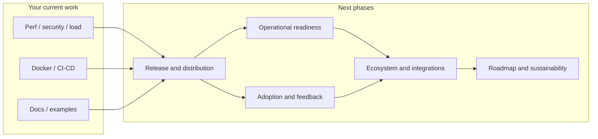

# What Comes After Your Current Checklist

After you finish **performance testing**, **security audits**, **load testing**, **Docker containerization**, **CI/CD** (if needed), **documentation**, and **example integrations**, the logical next phases are below. These are ordered by typical sequence; you can parallelize or skip based on whether OpenScript is internal, open source, or commercial.

---

## 1. Release and distribution

- **Versioning and changelog**: Adopt semantic versioning and maintain a `CHANGELOG.md` (or use conventional commits + automated changelog) so consumers know what changed and when.
- **Packaging**: If others will install it as a library or CLI, consider publishing to **PyPI** (e.g. `pip install openscript`) so integration is one command; keep API stable or clearly document breaking changes.
- **Container registry**: If you use Docker, publish images to a registry (e.g. Docker Hub, GHCR, ECR) and tag by version and `latest` so deployments are reproducible.
- **Release notes**: For each release, write short release notes (features, fixes, upgrade path) and attach them to git tags or GitHub/GitLab releases.

This gives you a clear “v1” or “v0.x” story and a repeatable release process.

---

## 2. Operational readiness (if you or others run it in production)

- **Runbooks**: Document how to deploy, scale, roll back, and handle common failures (e.g. detector overload, policy misconfiguration). Link from README or docs.
- **Monitoring and alerting**: You already have [observability (logging, metrics)](src/observability/); define which metrics matter for SLOs (e.g. scan latency, error rate) and how to alert (e.g. Prometheus + Alertmanager, or your existing stack).
- **Backup and recovery**: If OpenScript stores state (policies, config), document backup/restore and any DR expectations so operators know recovery steps.

This reduces “it works on my machine” and makes the system debuggable and recoverable in production.

---

## 3. Adoption and feedback loops

- **Early users**: Identify 1–2 internal or friendly external teams to integrate OpenScript and use it in real flows. Their feedback will drive the next priorities.
- **Usage and quality metrics**: Decide what “success” looks like (e.g. scans/day, false positive rate, time-to-detect). Instrument or log enough to measure it without compromising privacy.
- **Feedback channel**: Provide a simple way to report issues and ideas (GitHub Issues, Slack, or email) and triage regularly so the roadmap stays aligned with real use.

This turns “shipped” into “used and improved.”

---

## 4. Ecosystem and integrations

- **SDK or client library**: If callers are mostly Python, a small `openscript` client (or SDK) that wraps your API can reduce integration friction and standardize retries, timeouts, and error handling.
- **More example integrations**: Beyond your initial examples, add 1–2 integrations for popular stacks (e.g. LangChain, LlamaIndex, or a generic “proxy in front of OpenAI”) so new adopters can copy-paste and adapt.
- **Compliance and certifications**: Your README mentions compliance; if you target regulated industries, plan for any required audits, attestations, or certifications (e.g. SOC 2, ISO) and document how OpenScript supports them.

This makes OpenScript easier to adopt and trust in enterprise environments.

---

## 5. Roadmap and sustainability

- **Backlog and prioritization**: Keep a simple roadmap (e.g. in README, GitHub Projects, or a doc) with “next,” “later,” and “maybe” so contributors and users know direction.
- **Deprecation and compatibility**: Define a policy for breaking changes (e.g. “we support the last 2 major versions” or “6 months’ notice for deprecated APIs”) and document it.
- **Dependency and security maintenance**: Use Dependabot or similar to track dependency updates; schedule periodic security and dependency reviews so the project doesn’t go stale.

This keeps the project maintainable and predictable over time.

---

## 6. If open source: community and governance

- **CONTRIBUTING.md**: Explain how to set up the repo, run tests, and submit PRs; reference your code style and test expectations.
- **Code of conduct and issue templates**: Add a CoC and GitHub issue/PR templates (bug, feature, question) to keep discussions focused and inclusive.
- **Ownership and governance**: Clarify who maintains the project, how decisions are made, and whether you’re open to maintainers or a lightweight governance model once the project grows.

This helps contributors and users engage without overwhelming you.

---

## Suggested order (high level)

In practice: **release first** (version, package, and/or container) so there is a clear artifact to operate and adopt. Then add **operational docs and monitoring** if you or others run it in production. In parallel, **get early users and feedback**, then **expand ecosystem and integrations** and **lock in roadmap and maintenance** so the project stays healthy long term.

If you tell me whether OpenScript is internal-only, open source, or commercial, I can narrow this to a minimal “do these 3 things next” list and, if you want, turn any of these phases into a concrete implementation plan (e.g. “Release and distribution” with exact file changes and CI steps).